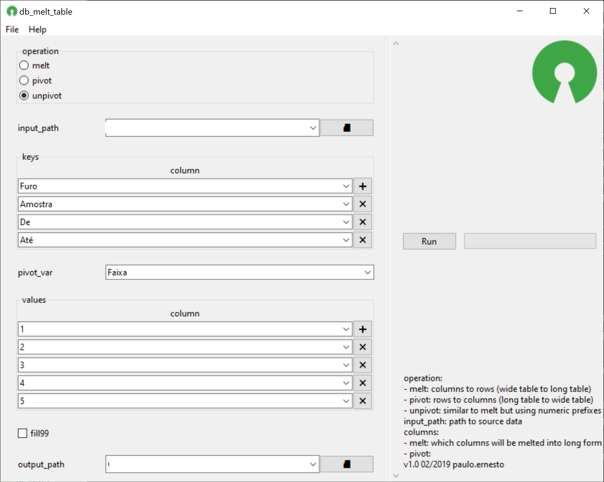

## 📌 Description
melt, pivot or unpivot columns
## 📸 Screenshot

## 📝 Parameters
Name|optional|description
---|---|------
input_path||path to source data
operation|melt|columns to rows (wide table to long table)
|pivot|rows to columns (long table to wide table)
|unpivot|similar to melt but using numeric prefixes
keys|❎|fields that will be used a classification
pivot_var|❎|field that will be used as pivot
values|❎|fields that will be melt or pivoted
fill99||replace null with -99
output_path|☑️|path to save the updated file in a supported format
## 📓 Notes
## 📚 Examples
## 💎 License
Apache 2.0
